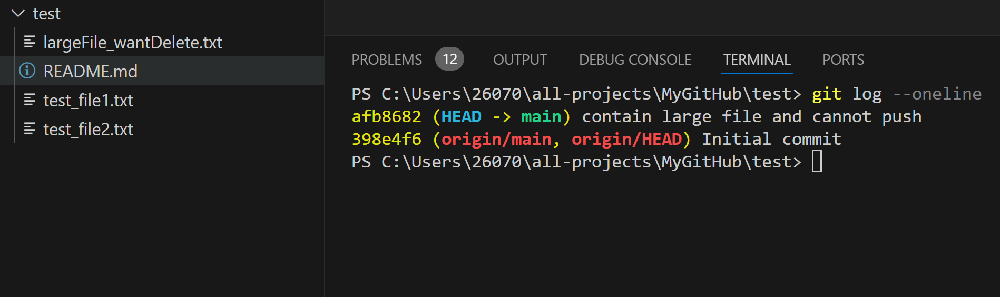
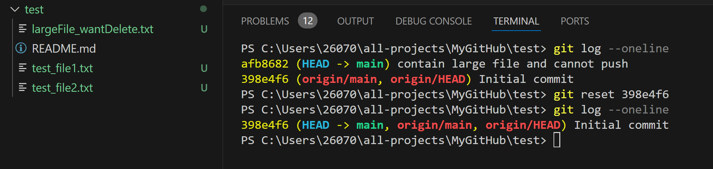
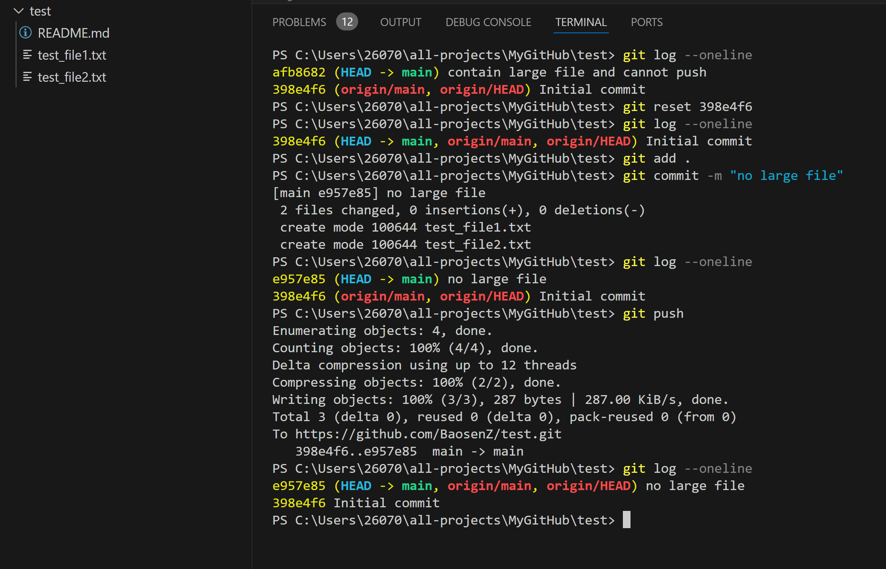

If you git commit a large file and cannot push to remote repo. What should you do?

If you just work in the local repo, you just need to delete the recent commit history. How to do that? 

The image shows the problem. In `git lot --oneline`, you can see you commit history. Your local repo HEAD main repo is one commit ahead of remote origin/main. Your git root is shown in the left panel. There is one `largeFile_wantDelete.txt` file. You commit it and somehow it cannot push (or other case that you don't want to push to remote). What we want is to delete the commit history `afb8682`.



do the following:
```
git log --oneline
git reset 398e4f6 (replace the commit history you want to go back)
```
you can see that the wroing commit history is deleted, but all your files are kept. 



Then you can remove the `largeFile_wantDelete.txt` or add a gitignore to ignore this large file. After this, you are good to git add, commit, and push to remote repo. 

